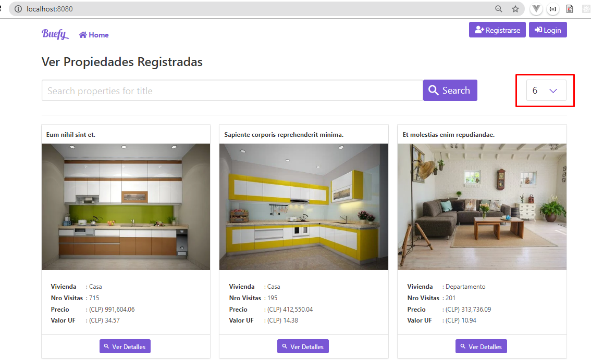
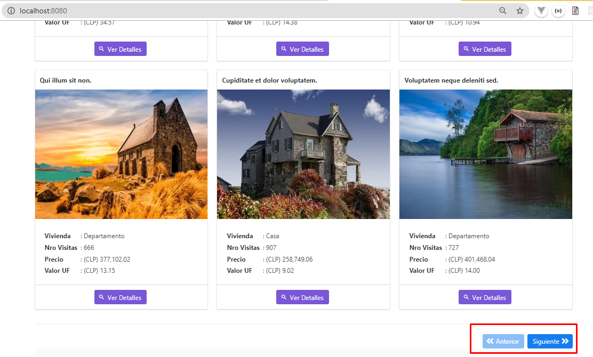
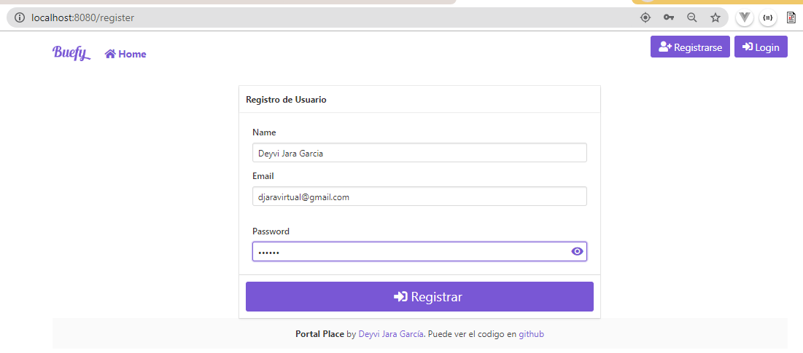
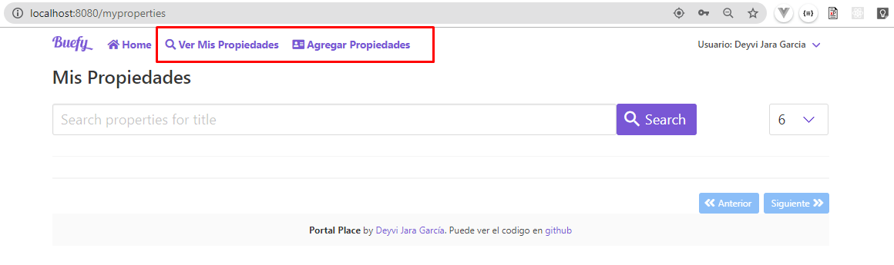
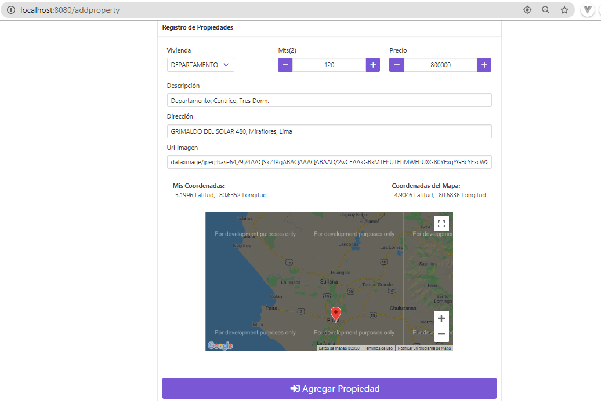
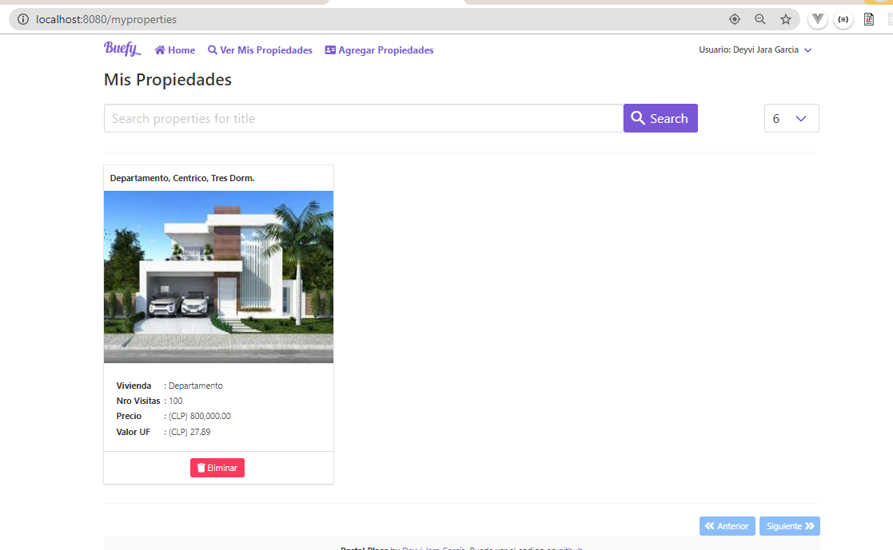
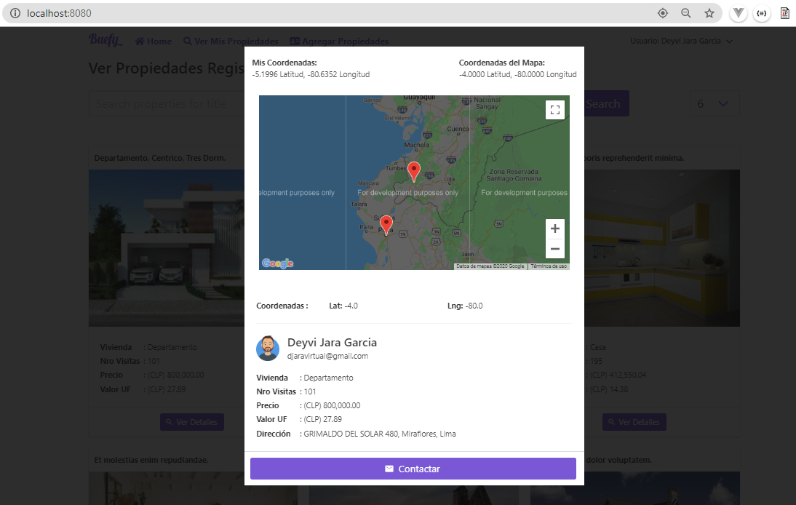
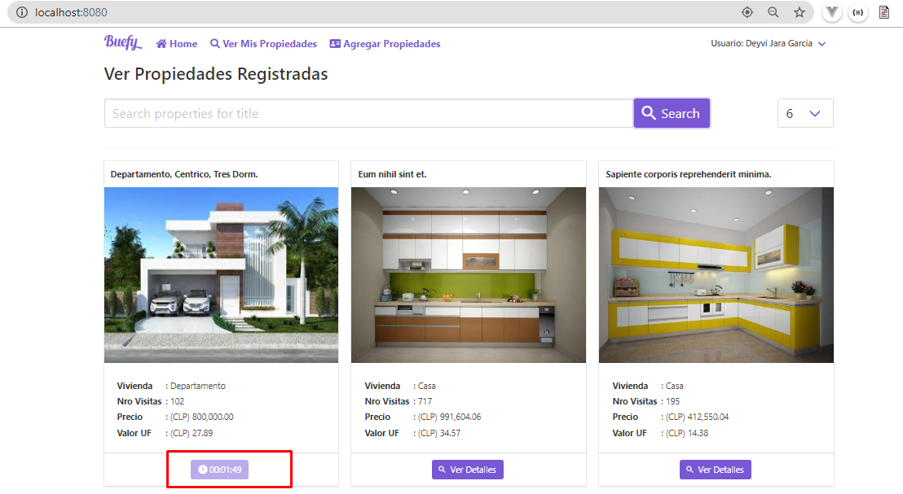
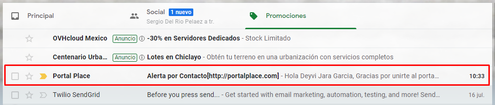
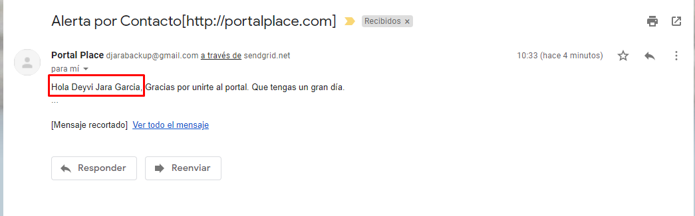

# Aplicación para registrar propiedades usando Vue.js con Vuex

##### Descripción:

Esta es una aplicación frontend que se conecta con una **ApiRest** realizada en **_RubyOnRails_**.

##### Caracteristicas del Frontend:

- En el **_Home_** se muestran la lista de todas las propiedades registradas. Cada propiedad se muestra en una cartilla.
- Se muestra una paginación por número de página(s) (perPage) y permite avanzar entre cada una de las páginas con los botones **_Anterior y siguiente_**.
- Al presionar el boton **_ver detalles_** se muestra un modal con la ubicación en google maps, centrando el mapa en la ubicación con las coordenadas que fueron registradas.
- Se incrementa el numero de visitas al presionar \***\*ver detalles\*\*** de la propiedad.
- El modal de la cartilla presenta un boton \***\*Contactar\*\*** que permite enviar una notificación por correo al propietario.
- Se realiza un bloqueo por 6 minutos evitando que se vuelva a enviar una notificación al usuario, pasado los 6 minutos se vuelve activar el boton.
- El boton registrar permite al usuario ingresar al panel donde podrá ingresar propiedades.
- El boton Login permite acceder al panel en donde puede borrar y crear nuevas propiedades

### Técnologia empleada

- [VueJS]
- [Vuex]
- [Buefy]
- [Bulma]

### Instalación

Instale las dependencias y devDependencies e inicie el servidor.

```sh
$ npm install
```

### Configuración

Setear las variables de configuración para los archivos \***\*.env y .env.production\*\***

```sh
VUE_APP_API_URL=http://localhost:3000/apiwithrubyonrails
VUE_APP_API_TIME_CONTACT=6
VUE_APP_API_PERPAGE_GRID=6
VUE_APP_KEY_API_GOOGLE_MAPS = MY-KEY-GOOGLE-MAPS
```

### Compila y recarga los archivos en modo Desarrollo

```
$ npm run dev
```

### Compila y Minimiza los archivos para el despliegue de Producción

```
$ npm run build
```

## Frontend de la Aplicacion












**Free Software**

[//]: #
[vuejs]: https://vuejs.org/
[vuex]: https://vuex.vuejs.org/
[buefy]: https://buefy.org/
[bulma]: https://bulma.io/documentation/
